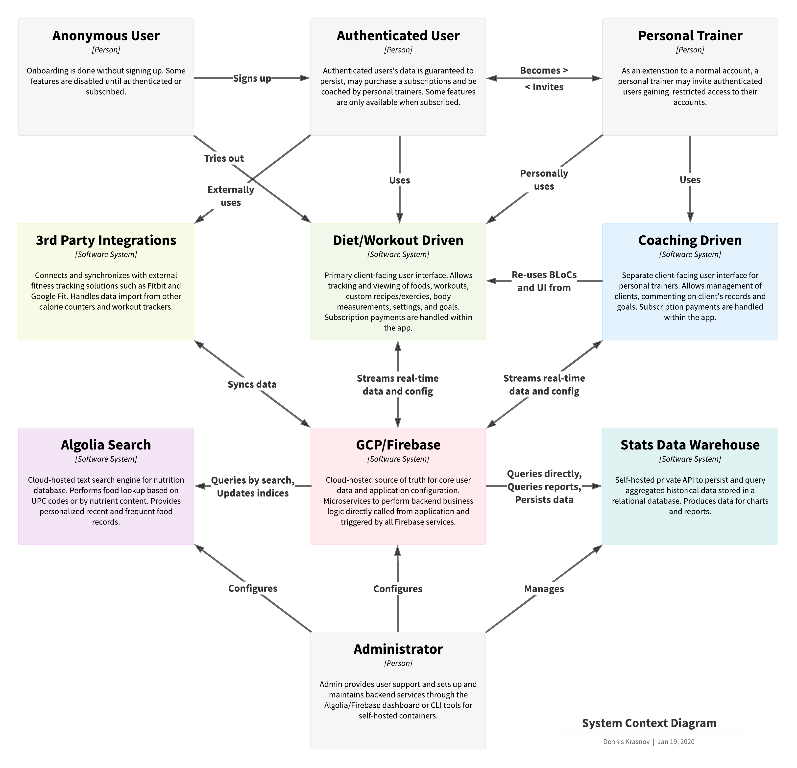
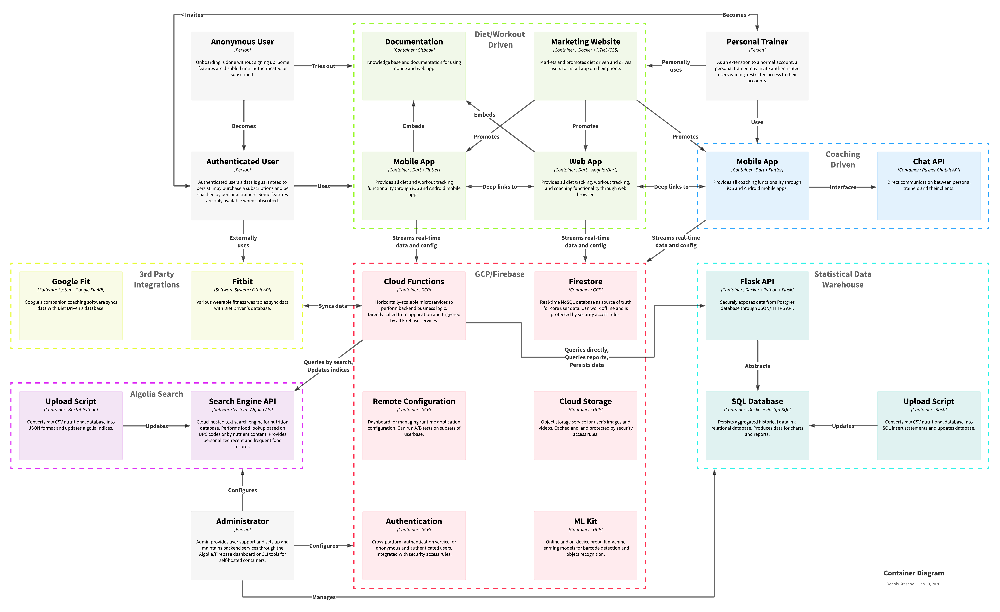
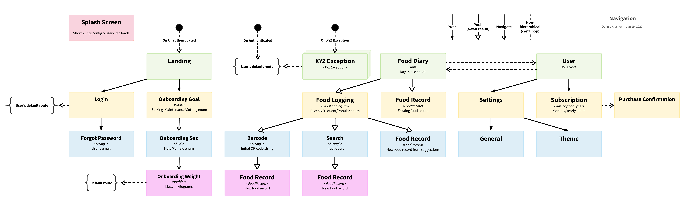
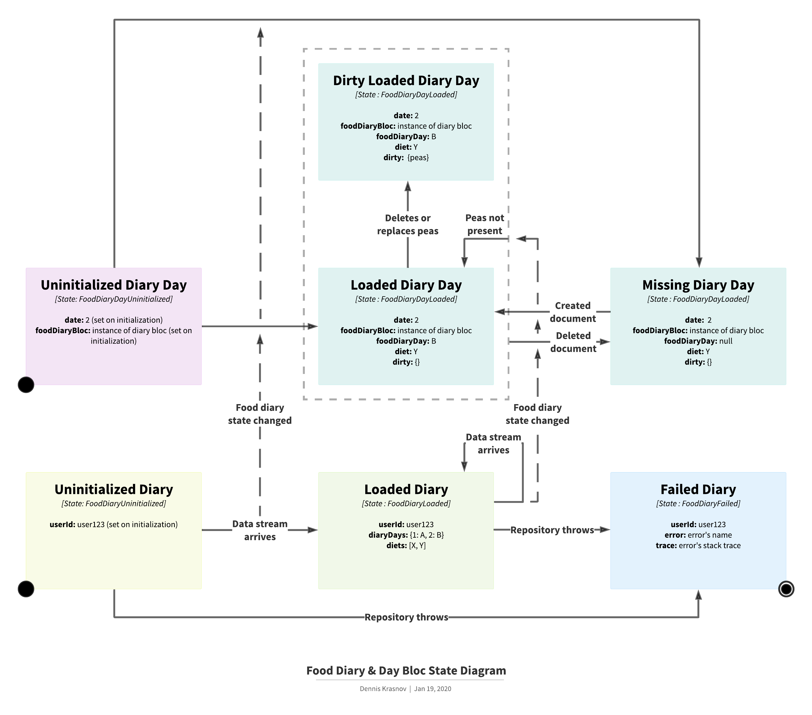
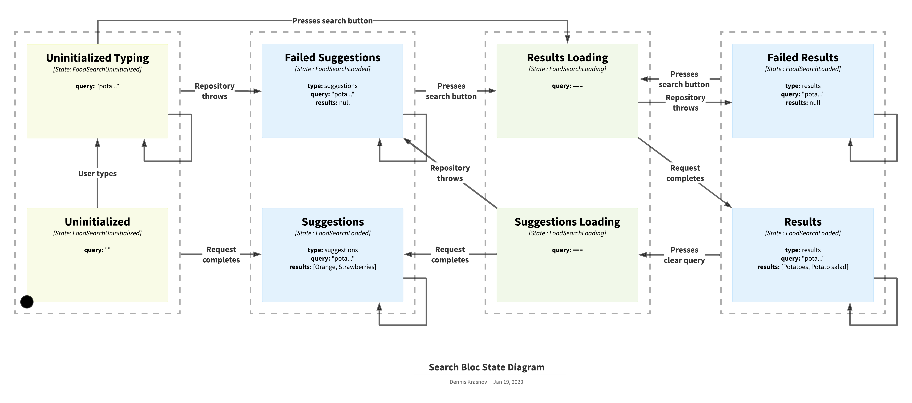

   <!-- width="200" -->

# Diet Driven

<!--  -->

<!--  -->

Diet Driven is a highly customizable calorie counter mobile app for iOS and Android.

Created in frustration of current solutions and their lack of features and customization, Diet Driven focuses on the needs of a power user.

<!-- 
TODO: make it scaled down version of proper aspect ratio -->

<!-- ## Screenshots

  
  
  

 -->

## Features
* **Food record logging**: objectively keep track of how much you've eaten.
* **Real-time database**: your data is synchronized in real-time, works while offline.
* **Highly customizable**: personalize everything from theme to core functionality.
* **Fully deep linkable**: use deep links to navigate to any part of the app.
* **Clean user interface**: countless hours were spent optimizing the usability of the UI.
* **Configurable at runtime**: configure app parameters without releasing new versions.
* **Complete in-app usage logs**: see exactly what the app's doing from within the app.
* **End-to-end tested**: have confidence everything works as it should.

## Architecture
### High-level
##### System Context Diagram

##### Container Diagram

##### Navigation Diagram

### Bloc-level
##### Food Diary & Day Bloc

##### Search Bloc

## Monorepo Structure
##### [Flutter App](https://github.com/Dennis-Krasnov/Diet-Driven/tree/develop/flutter_app)
Flutter mobile application and bloc backend.

##### [Firebase](https://github.com/Dennis-Krasnov/Diet-Driven)
Firebase configurations and serverless functions. 

##### [Bloc Logging](https://github.com/Dennis-Krasnov/Diet-Driven/tree/develop/bloc_logging)
Logging package made to work well with bloc architecture.

##### [Flutter Deep Link Navigation](https://github.com/Dennis-Krasnov/Flutter-Deep-Link-Navigation)
Provides an elegant abstraction for complete deep linking navigation in Flutter.

I separated the navigation system from Diet Driven into its own package and published it.

## Building from Source
* [Install Flutter](https://flutter.dev/docs/get-started/install)
* [Configure Firebase](https://firebase.google.com/docs/flutter/setup)
* [In the future: Nutrition Database](...)

<!-- * [Congigure key.properties]() -->

##### Contributing
Feel free to add issues with bugs or ideas. Any pull requests are very welcome!

##### Author
[Dennis Krasnov](https://denniskrasnov.com)